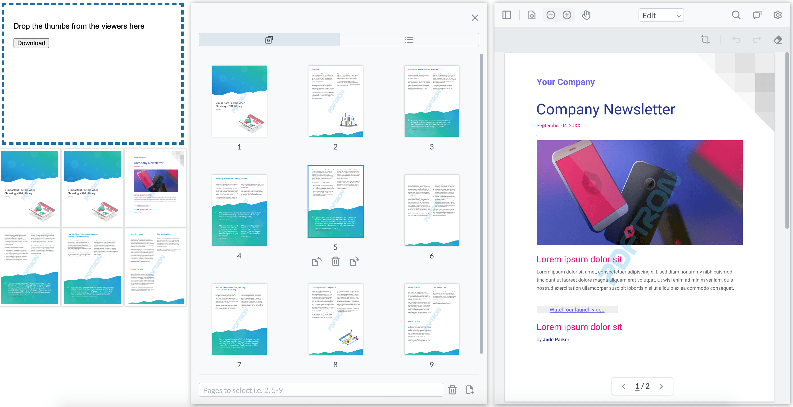

# WebViewer - React - Dropzone sample

[WebViewer](https://apryse.com/products/webviewer) is a powerful JavaScript-based PDF Library that is part of the [Apryse SDK](https://apryse.com/). It provides a slick out-of-the-box responsive UI that interacts with the core library to view, annotate, and manipulate PDFs that can be embedded into any web project.

You can [watch a video](https://youtu.be/ZKt38W7Ro4Y) that demonstrates the app from the end-user’s perspective.



This repo is specifically designed for any user interested in implementing a drop zone, where users can drag and drop thumbnails from two viewers and download the resulting file. 

## Initial setup

1. [Node.js](https://nodejs.org/en).
2. IDE used in this sample is Visual Studio Code with NPM commands within its terminal.
3. [GitHub command line](https://github.com/git-guides/install-git) `git`.


## Install

```
gh repo clone ApryseSDK/webviewer-document-merge
cd webviewer-document-merge
npm install
```

## Run

```
npm start
```

## Build

Run `npm run build` to build the project. The build artifacts will be stored in the `build/` directory. See the section about [deployment](https://facebook.github.io/create-react-app/docs/deployment) for more information.

To test the build directory locally you can use [serve](https://www.npmjs.com/package/serve) or [http-server](https://www.npmjs.com/package/http-server). In case of serve, by default it strips the .html extension stripped from paths. We added serve.json configuration to disable cleanUrls option. 


Visit PDFTron's [WebViewer](https://docs.apryse.com/documentation/web/) page to see what else you can do with the WebViewer!

## WebViewer APIs

* [API documentation](https://docs.apryse.com/api/web/WebViewerInstance.html)
* [@pdftron/webviewer-react API documentation](https://github.com/ApryseSDK/webviewer-react)

## Showcase

Refer to a running sample on Apryse SDK [showcase page](https://showcase.apryse.com/).

## Contributing

Any submission to this repo is governed by these [guidelines](/CONTRIBUTING.md).


## License

For licensing, refer to [License](LICENSE).
